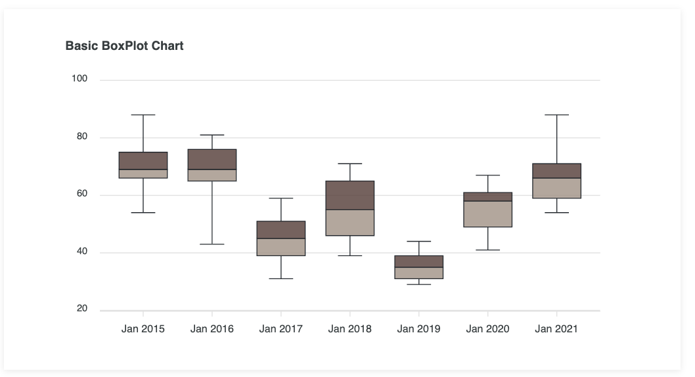
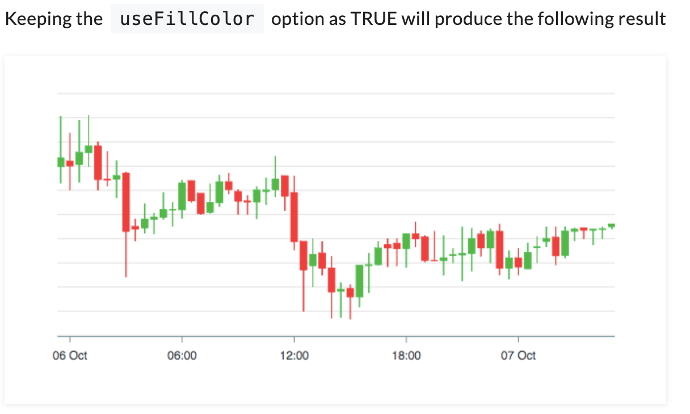
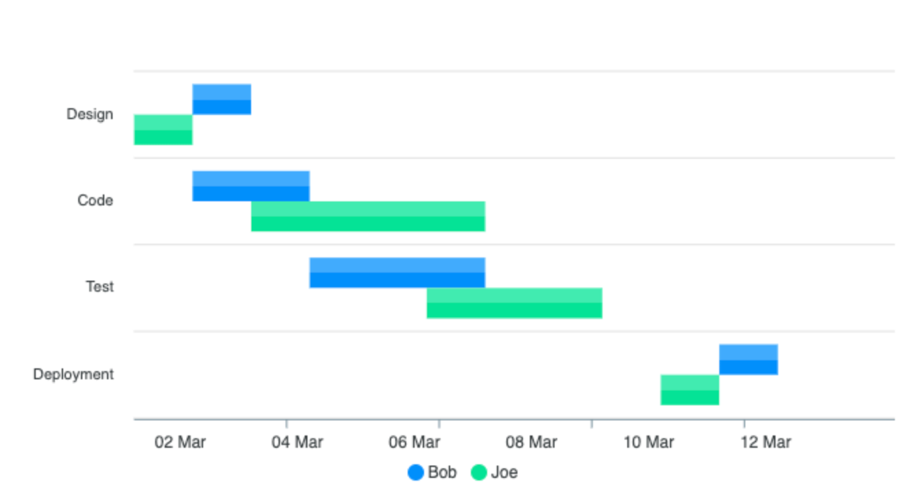
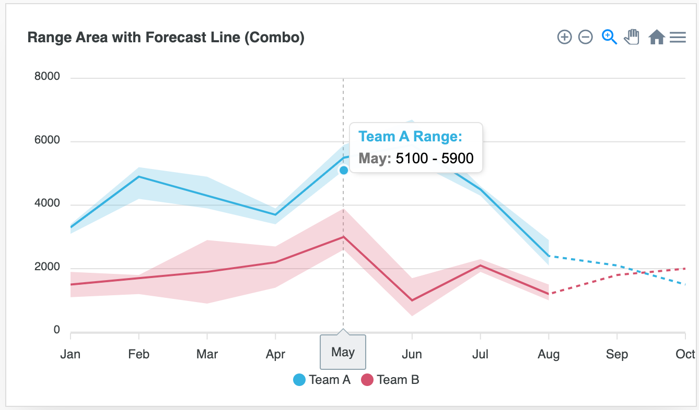
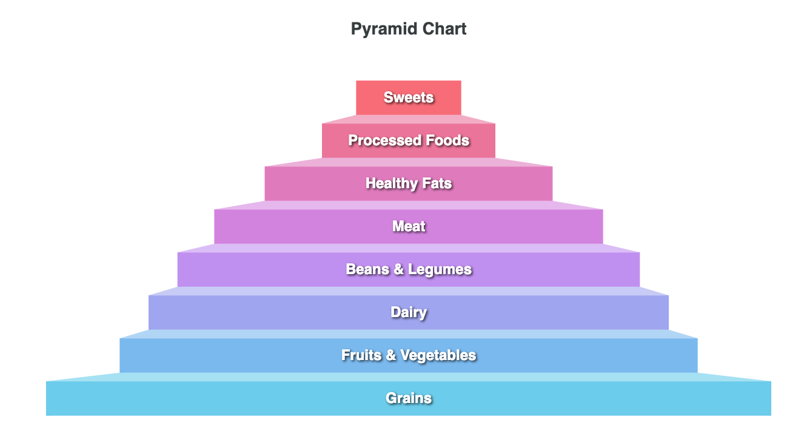
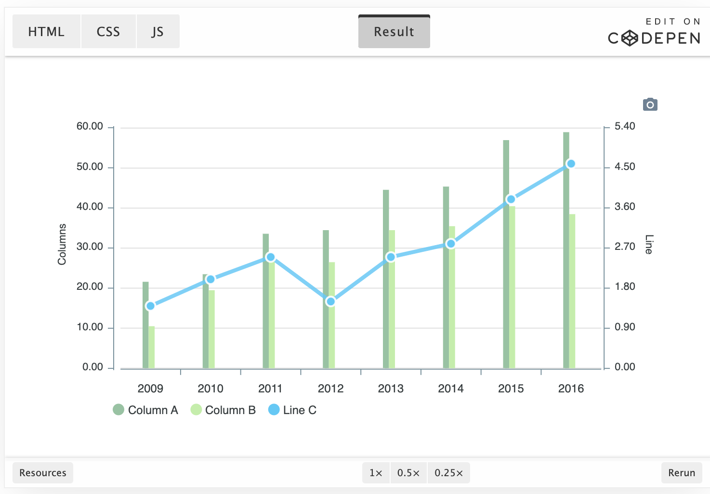
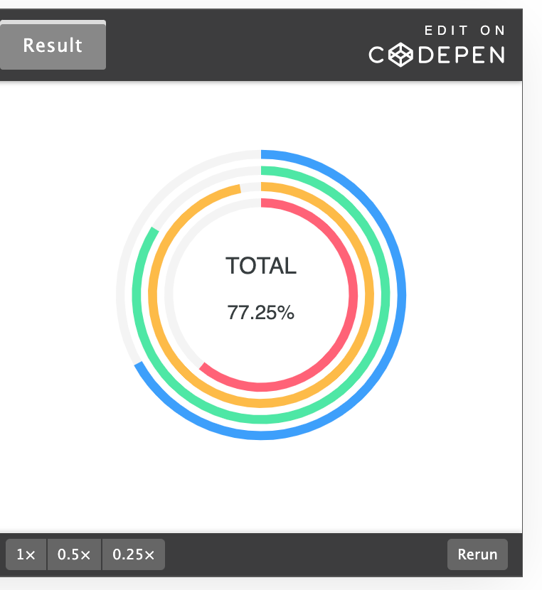
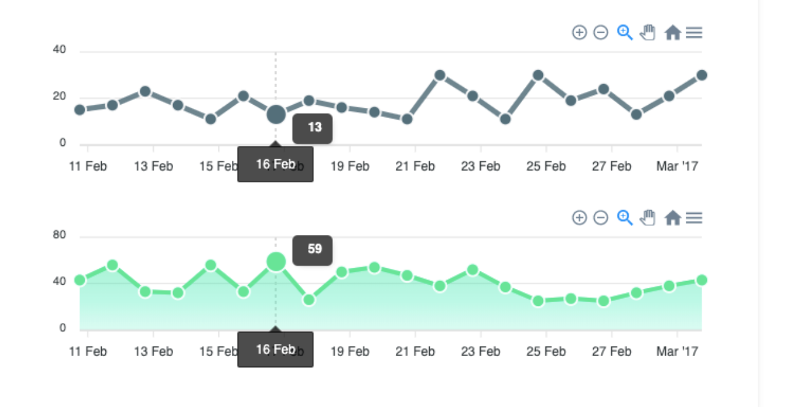

#    Taipei City Dashboard Open Source FE

## Taipei Codefest 2023


Hey! Before you go any further, we would like to invite you to participate in an exciting hackathon event on Nov 18 - 19 this year. 


Taipei Codefest is hosted by the Taipei City Government to promote and accelerate the open-source effort of Taipei City Dashboard. Contestants will attempt to create more than 4 new components for Taipei City Dashboard in 32 hours. With a top prize of NT$300,000 and unlimited food during the contest, this is definitely an opportunity you wouldn't want to miss. Check out more information on the hackathon's official site: https://codefest.taipei

## Introduction

Taipei City Dashboard is a data visualization platform developed by [Taipei Urban Intelligence Center (TUIC)](https://tuic.gov.taipei/en).

Our main goal is to create a comprehensive data visualization tool to assist in Taipei City policy decisions. This was achieved through the first version of the Taipei City Dashboard, which displayed a mix of internal and open data, seamlessly blending statistical and geographical data.

Fast forward to mid-2023, as Taipei City’s open data ecosystem matured and expanded, our vision gradually expanded as well. We aimed not only to aid policy decisions but also to keep citizens informed about the important statistics of their city. Given the effectiveness of this tool, we also hoped to publicize the codebase for this project so that any relevant organization could easily create a similar data visualization tool of their own.

Our dashboard, made yours.

Based on the above vision, we decided to begin development on Taipei City Dashboard 2.0. Unlike its predecessor, Taipei City Dashboard 2.0 will be a public platform instead of an internal tool. The codebase for Taipei City Dashboard will also be open-sourced, inviting all interested parties to participate in the development of this platform.

We have since completed the initial layouts and basic functionalities of Taipei City Dashboard 2.0 and feel the time is right to begin sharing the development process with the general public. From now on, you will be able to suggest features and changes to Taipei City Dashboard and develop the platform alongside us. We are excited for you to join Taipei City Dashboard’s journey!

Please refer to the docs for the [Chinese Version](https://tuic.gov.taipei/documentation/front-end/introduction) (and click on the "switch languages" icon in the top right corner).

[Demo](https://tuic.gov.taipei/dashboard-demo) | [License](https://github.com/tpe-doit/Taipei-City-Dashboard-FE/blob/main/LICENSE) | [Code of Conduct](https://github.com/tpe-doit/Taipei-City-Dashboard-FE/blob/main/.github/CODE_OF_CONDUCT.md) | [Contribution Guide](https://tuic.gov.taipei/documentation/front-end/contribution-overview)

## Quick Start

### Docker

1. Install [Docker](https://www.docker.com/products/docker-desktop/) on your computer and start running it.
2. Fork this repository then clone the project to your computer. Execute `pwd` (mac) or `cd` in the repository terminal to get the complete path.
3. Execute the following command in the system terminal and replace "<repository path>" with the path you got in step 2.

```bash
docker run -v <repository path>:/opt/Taipei-City-Dashboard-FE -p 80:80 -it node:18.18.1-alpine3.18  sh
```

4. Execute the following commands to enter the project folder and install packages.

```bash
cd /opt/Taipei-City-Dashboard-FE
npm install
```

5. You should now be able to locally host this project by executing `npm run dev` in the respository terminal.
6. Refer to the [Docs](https://tuic.gov.taipei/documentation/front-end/project-setup) to complete further configurations.

### Local Environment

1. Download [Node.js](https://nodejs.org/en) on your computer.
2. Fork this repository then clone the project to your computer.
3. Execute `npm install` in the respository terminal
4. You should now be able to locally host this project by executing `npm run dev` in the respository terminal.
5. Refer to the [Docs](https://tuic.gov.taipei/documentation/front-end/project-setup) to complete further configurations.

## Documentation

Check out the complete documentation for Taipei City Dashboard FE [here](https://tuic.gov.taipei/documentation).

## Contributors

Many thanks to the contributors to this project!

<a href="https://github.com/tpe-doit/Taipei-City-Dashboard-FE/graphs/contributors">

</a>


# ntu777

## Reference

### Apexcharts
https://apexcharts.com/docs/chart-types/boxplot/

Chart Types

- [x] Line Chart
- [x] Area Chart
- [x] Bar Chart
- [x] Column Chart
- [ ] **BoxPlot**
	- [ ] [doc](https://apexcharts.com/docs/chart-types/boxplot/)
		  

- [ ] **Candlestick**
	- [ ] [doc](https://apexcharts.com/docs/chart-types/candlestick/)
		  

- [ ] **Range Bar Chart**
	- [ ] [doc](https://apexcharts.com/docs/chart-types/range-bar-chart/)
		  


- [ ] **Range Area Chart**
	- [ ] [doc](https://apexcharts.com/javascript-chart-demos/range-area-charts/combo/)
		  
- [x] Heat Map Chart
- [x] Treemap Chart
- [ ] Funnel Chart
	- [ ] [doc](https://apexcharts.com/docs/chart-types/funnel-chart/)
	  

- [ ] Multi-Axis Chart
	- [ ] [doc](https://apexcharts.com/docs/chart-types/multiple-yaxis-scales/)
		  

- [x] Pie / Donut
- [x] Radar
- [ ] **RadialBar / Circular Gauge**
	有用過，但是做得更潮
	- [ ] [doc](https://apexcharts.com/docs/chart-types/radialbar-gauge/)
	- [ ]   
- [ ] Synchronized charts
	- [ ] [doc](https://apexcharts.com/docs/chart-types/synchronized-charts/)
	  


## Mapbox

[Style a heatmap layer | Mapbox Studio manual | Mapbox](https://docs.mapbox.com/studio-manual/examples/heatmap-layer/)
